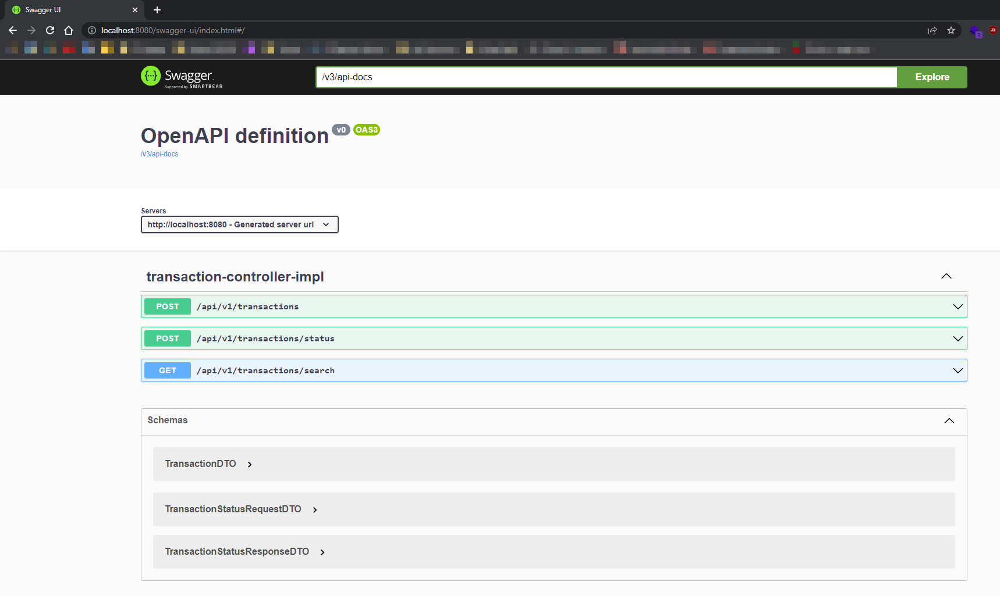
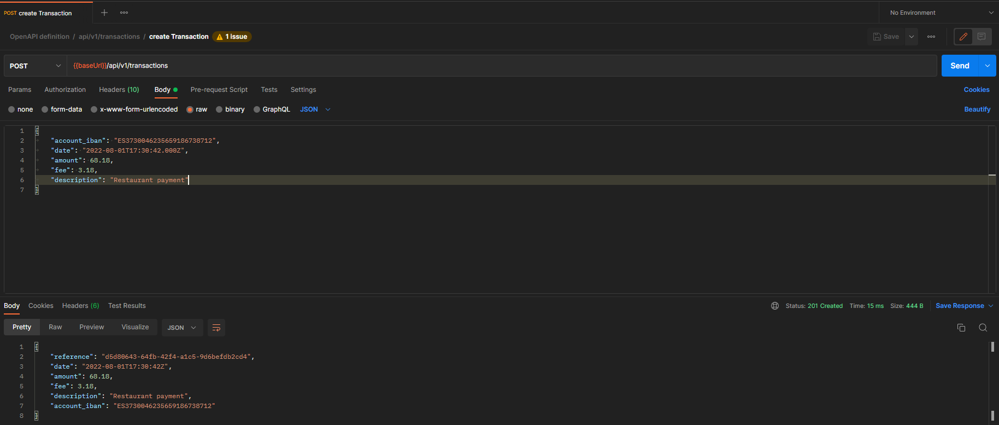
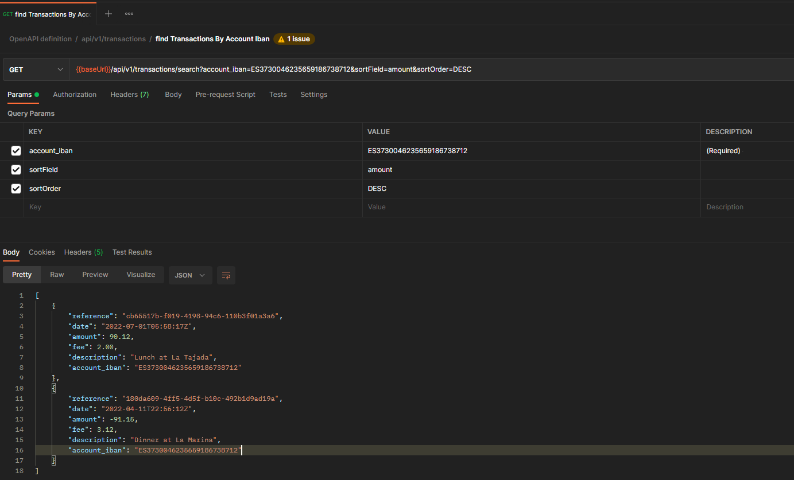

# Spring Boot Rest API that manages transactions information

## Tech Stack
- IDE: IntelliJ IDEA Community Edition (2022.1.1)
- Java 17
    - [Java Text Blocks](https://www.baeldung.com/java-text-blocks)
    - [Switch Statement](https://medium.com/@javatechie/the-evolution-of-switch-statement-from-java-7-to-java-17-4b5eee8d29b7)
- Spring Boot: 2.7.0
     - Spring Data
     - Spring DevTools
- MapStruct
- Lombok
- SpringDoc OpenApi
- Maven 3.8.4
- H2 Database

## Prerequisites to test/run the application
- Java 17
- Maven 3.8.4

## Updated Requirements
While I was developing this project, I had to update the requirements as I encountered some issues.
1. reference (optional): The transaction unique reference number in our system. ~~If not present, the system will generate one.~~ **The
     reference number is the ID of the transaction, and it will ALWAYS be automatically generated by the system. If we allow the 
   client to provide
     a reference number we may have inconsistency in our database or if the client provides an already existing reference in our database
     it will give an error back.**

## Run tests
You can use your favorite IDE to run the tests or use the following command:
```shell
mvn test
```

## Run the application
1. Clone the repository
2. In the cloned folder repository, run the following command:
```shell
mvn spring-boot:run
```

## Available endpoints
Since the project uses SpringDoc OpenApi, we can see the available endpoints at the following link:

[http://localhost:8080/swagger-ui/index.html](http://localhost:8080/swagger-ui/index.html)

[Example of the first time you access Swagger UI](./readme-resources/img/01-swagger-ui.png)


### Examples to call the endpoints
You can use the HTTP client of your choice to call the endpoints. In the next examples I will use Postman to perform the requests.

Using the [import feature of Postman](https://learning.postman.com/docs/getting-started/importing-and-exporting-data/) you can import the OpenAPI definition from the following link: [http://localhost:8080/v3/api-docs](http://localhost:8080/v3/api-docs)

#### Create a new transaction
- `POST /api/v1/transactions`
```json
{
	"account_iban": "ES3730046235659186738712",
	"date": "2022-08-01T17:30:42.000Z",
	"amount": 68.18,
	"fee": 3.18,
	"description": "Restaurant payment"
}
```

[Example calling POST /api/v1/transactions](./readme-resources/img/02-create-transaction-example01.png)


#### Find transactions by account iban and sort by field and order
In order to have some data in our database when the application starts, I used a CommandLineRunner to create some transactions.
The iban account that will be used to perform the filtering and sorting is: `ES3730046235659186738712`
You could also use the [Create a new transaction](#create-a-new-transaction) endpoint to create as many transactions as you wish.

- `GET /api/v1/transactions/search?account_iban=ES3730046235659186738712&sortField=amount&sortOrder=DESC`

[Example calling GET /api/v1/transactions/search](./readme-resources/img/03-find-transactions-by-account-iban.png)



#### Transaction status
- `POST /api/v1/transactions/status`


Based on the following rules, you'll need to create a transaction per business rule and use the reference number you obtain from calling 
the endpoint [Create a new transaction](#create-a-new-transaction) to obtain the status of the transaction.

Payload to call `POST /api/v1/transactions/status`
```json
{
  "reference":"12345A",
  "channel":"CLIENT"
}
```
- reference (mandatory): The transaction reference number
channel (optional): The type of the channel that is asking for the
- status. It can be any of these values:
`CLIENT`, `ATM`, `INTERNAL`

Response:
```json
{
  "reference":"12345A",
  "status":"PENDING",
  "amount":193.38,
  "fee":3.18
}
```

- reference: The transaction reference number
- status: The status of the transaction. It can be any of these values: `PENDING`, `SETTLED`, `FUTURE`, `INVALID`
- amount: the amount of the transaction
- fee: The fee applied to the transaction

**Business Rules**

A)
```
Given: A transaction that is not stored in our system
When: I check the status from any channel
Then: The system returns the status 'INVALID'
```

Example payload:
```json
{
  "reference": "99463375-d63a-4176-aa03-14140adb1cb8",
  "channel": "INTERNAL"
}
```

Example response:
```json
{
  "reference": "99463375-d63a-4176-aa03-14140adb1cb8",
  "status": "INVALID"
}
```

---

B)

**First create the following transaction**

[Create a new transaction](#create-a-new-transaction) with the following payload:
```json
{
  "account_iban": "ES3730046235659186738712",
  "date": "2021-06-01T17:30:42.000Z",
  "amount": 88.18,
  "fee": 3.18,
  "description": "Restaurant payment"
}
```

```
Given: A transaction that is stored in our system
When: I check the status from CLIENT or ATM channel
    And the transaction date is before today
Then: The system returns the status 'SETTLED'
    And the amount substracting the fee
```

Example payload:

_Using the reference obtained when calling the endpoint [Create a new transaction](#create-a-new-transaction)_
```json
{
  "reference": "c7f778d2-faa5-4c48-a19b-4f3cc1350d39",
  "channel": "CLIENT"
}
```

Example response:

```json
{
  "reference": "c7f778d2-faa5-4c48-a19b-4f3cc1350d39",
  "status": "SETTLED",
  "amount": 85.00
}
```
---

C)
```
Given: A transaction that is stored in our system
When: I check the status from INTERNAL channel
    And the transaction date is before today
Then: The system returns the status 'SETTLED'
    And the amount
    And the fee
```

Example payload:

_Using the reference obtained when calling the endpoint [Create a new transaction](#create-a-new-transaction)_
```json
{
  "reference": "c7f778d2-faa5-4c48-a19b-4f3cc1350d39",
  "channel": "INTERNAL"
}
```

Example response:

```json
{
  "reference": "c7f778d2-faa5-4c48-a19b-4f3cc1350d39",
  "status": "SETTLED",
  "amount": 88.18,
  "fee": 3.18
}
```
---

D)

**First create the following transaction**

[Create a new transaction](#create-a-new-transaction) with the following payload:

**MAKE SURE THE DATE IS FROM TODAY**
```json
{
  "account_iban": "ES3730046235659186738712",
  "date": "2022-06-01T17:30:42.000Z",
  "amount": 88.18,
  "fee": 3.18,
  "description": "Restaurant payment"
}
```

```
Given: A transaction that is stored in our system
When: I check the status from CLIENT or ATM channel
    And the transaction date is equals to today
Then: The system returns the status 'PENDING'
    And the amount substracting the fee
```

Example payload:

_Using the reference obtained when calling the endpoint [Create a new transaction](#create-a-new-transaction)_
```json
{
  "reference": "7eebabc8-d6a1-4099-8f49-0ff7cff91d4c",
  "channel": "CLIENT"
}
```

Example response:
```json
{
  "reference": "7eebabc8-d6a1-4099-8f49-0ff7cff91d4c",
  "status": "PENDING",
  "amount": 85.00
}
```
---

E)
```
Given: A transaction that is stored in our system
When: I check the status from INTERNAL channel
    And the transaction date is equals to today
Then: The system returns the status 'PENDING'
    And the amount
    And the fee
```

Example payload:

_Using the reference obtained when calling the endpoint [Create a new transaction](#create-a-new-transaction)_
```json
{
  "reference": "7eebabc8-d6a1-4099-8f49-0ff7cff91d4c",
  "channel": "INTERNAL"
}
```

Example response:
```json
{
  "reference": "7eebabc8-d6a1-4099-8f49-0ff7cff91d4c",
  "status": "PENDING",
  "amount": 88.18,
  "fee": 3.18
}
```
---

F)

**First create the following transaction**

[Create a new transaction](#create-a-new-transaction) with the following payload:

```json
{
  "account_iban": "ES3730046235659186738712",
  "date": "2023-08-01T17:30:42.000Z",
  "amount": 88.18,
  "fee": 3.18,
  "description": "Restaurant payment"
}
```

```
Given: A transaction that is stored in our system
When: I check the status from CLIENT channel
    And the transaction date is greater than today
Then: The system returns the status 'FUTURE'
    And the amount substracting the fee
```

Example payload:

_Using the reference obtained when calling the endpoint [Create a new transaction](#create-a-new-transaction)_
```json
{
  "reference": "7eebabc8-d6a1-4099-8f49-0ff7cff91d4c",
  "channel": "CLIENT"
}
```

Example response:
```json
{
  "reference": "614f8662-a874-47b5-be45-a0abcf66d819",
  "status": "FUTURE",
  "amount": 85.00
}
```
---

G)
```
Given: A transaction that is stored in our system
When: I check the status from ATM channel
    And the transaction date is greater than today
Then: The system returns the status 'PENDING'
    And the amount substracting the fee
```

Example payload:

_Using the reference obtained when calling the endpoint [Create a new transaction](#create-a-new-transaction)_
```json
{
  "reference": "614f8662-a874-47b5-be45-a0abcf66d819",
  "channel": "ATM"
}
```

Example response:
```json
{
  "reference": "614f8662-a874-47b5-be45-a0abcf66d819",
  "status": "PENDING",
  "amount": 85.00
}
```
---

H)
```
Given: A transaction that is stored in our system
When: I check the status from INTERNAL channel
    And the transaction date is greater than today
Then: The system returns the status 'FUTURE'
    And the amount
    And the fee
```

Example payload:

_Using the reference obtained when calling the endpoint [Create a new transaction](#create-a-new-transaction)_
```json
{
  "reference": "614f8662-a874-47b5-be45-a0abcf66d819",
  "channel": "INTERNAL"
}
```

Example response:
```json
{
  "reference": "614f8662-a874-47b5-be45-a0abcf66d819",
  "status": "FUTURE",
  "amount": 88.18,
  "fee": 3.18
}
```